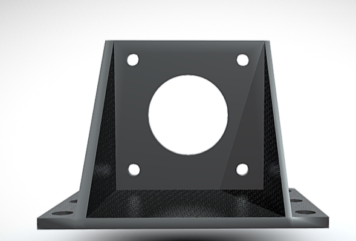
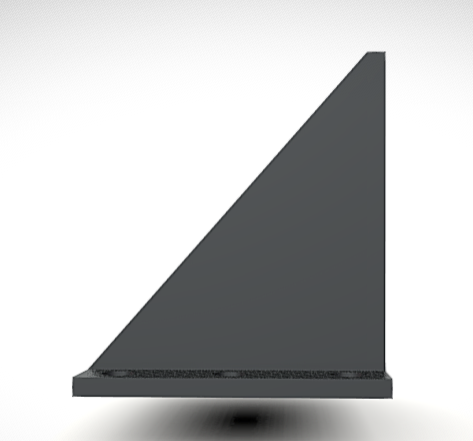
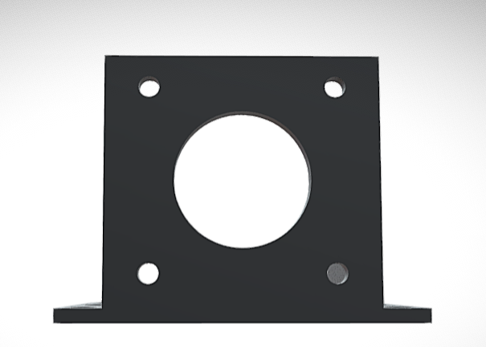
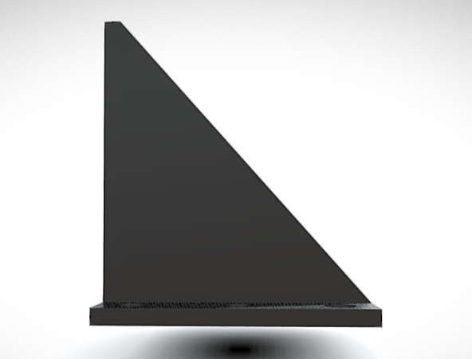
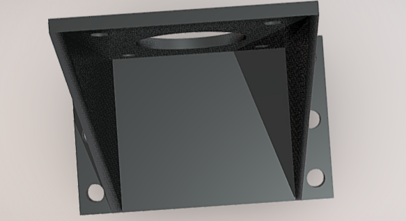
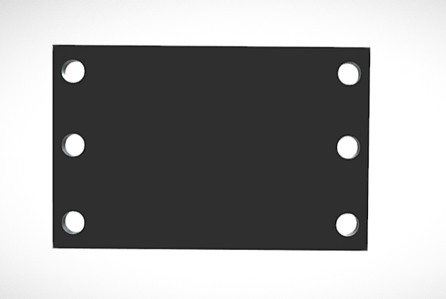

# Bracket Design and Beam Deflection Project

**Short description:**  
This project presents a simple **CAD model of a bracket and beam** with a basic analysis of beam deflection principles.  
It serves as an **engineering portfolio project** demonstrating understanding of structural design and mechanical behavior.

---

## 📁 Repository Structure
- `Design/` — CAD files (STEP/STL), 2D sketches, and renders.  
- `Calculations/` — hand calculations, formulas, and notes.  
- `Results/` — final images, diagrams, and summary visuals.  
- `README.md` — project description.  
- `LICENSE` — MIT license.

---

## 🛠 Tools Used
- **CAD Software:** Fusion 360 / FreeCAD / Blender  
- **Documentation:** Markdown (`.md`)  
- **Version Control:** Git & GitHub  

---

## 🧩 Key Concepts
- Beam deflection under uniform or point loads  
- Stress distribution and mechanical stability  
- Visualization of design process from sketch to result  

---

## 🖼 Design Sketches

Below are the main design sketches that illustrate the beam and bracket concept:

| Sketch | Preview |
|:------:|:--------:|
| **Sketch 1** |  |
| **Sketch 2** |  |
| **Sketch 3** |  |
| **Sketch 4** |  |
| **Sketch 5** |  |
| **Sketch 6** |  |

---

## 🚀 Future Improvements
- Add 3D simulation or stress analysis in Fusion 360  
- Create physical prototype or 3D print  
- Compare theoretical and simulated results  

---

## 👤 Author
Created by **Nurali Bakyt**  
📅 Year: **2025**  
🌍 Project Type: *Educational Portfolio — Mechanical Engineering*

---

## 📜 License
**MIT License** — free for educational and portfolio use.
